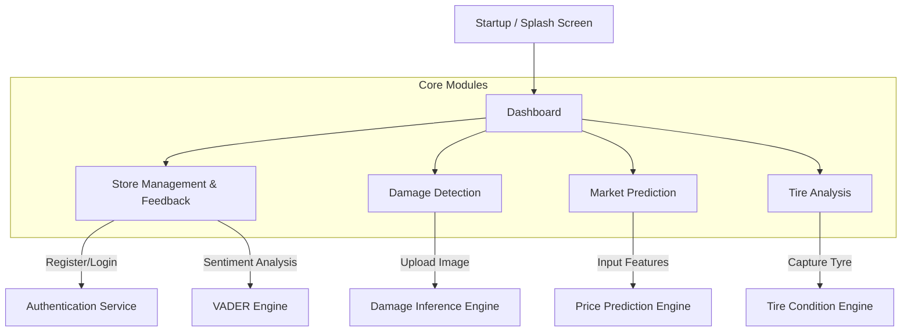

# CHAPTER 5: SYSTEM DEVELOPMENT

## 5.1 Navigation And Module Structure

The "AutoXpert" system is engineered as a component-based mobile application, where navigation is managed hierarchically to ensure a seamless user experience (UX). The system logic is divided into the Presentation Layer (Frontend) dealing with user interactions, and the Application Layer (Backend) handling the core processing.

**Figure 5.1: High-Level Module Interaction Diagram**



### 5.1.1 Module Breakdown
1.  **Damage Detection Module**: A vision-based module where users capture images. It routes data to the `DamageDetectionService` which aggregates results from two separate AI models (EfficientNet for classification + YOLO for localization).
2.  **Feedback & Sentiment Module**: Analyzes user reviews for automotive shops. It employs a custom "Singlish" enabled VADER engine to understand local vernacular (e.g., "Patta service").
3.  **Tire Health Prediction Module**: A hybrid AI system using ResNet50 for surface condition analysis and U-Net for tread depth segmentation.
4.  **Market Prediction Module**: A data-driven module collecting vehicle parameters (Year, Make, Mileage) to query a Random Forest Regressor for accurate price estimation.

---

## 5.2 Development Environment

The implementation phase required a robust environment capable of supporting both mobile application compilation and heavy machine learning model training.

### 5.2.1 Hardware Environment
The specific hardware configuration used to develop and train the system is listed below. A high-performance GPU was critical for the student's contribution of fine-tuning the ML models.

| Component | Specification | Usage & Justification |
| :--- | :--- | :--- |
| **Processor** | Intel Core i7-10750H (6 Cores) | Handling parallel threads for the Flask Server and React Native Bundler. |
| **GPU** | **NVIDIA GeForce GTX 1650 (4GB)** | **Crucial:** Used for CUDA-accelerated training of the custom U-Net and MobileNetV2 models. CPU training would have taken days; this reduced it to hours. |
| **RAM** | 16 GB DDR4 | Required to load the full deployment stack (Android Emulator + VS Code + Python Services) simultaneously. |
| **Test Device** | Samsung Galaxy S21 (Android 12) | Physical testing of Camera API latency and GPS sensor accuracy. |

### 5.2.2 Software Environment
*   **Operating System**: Windows 11 Pro.
*   **IDE**: Visual Studio Code (utilized for its multi-language support: Python & TypeScript).
*   **Virtualization**: Anaconda Environments (to isolate TensorFlow dependencies).
*   **Version Control**: Git (Local) and GitHub (Remote repository for backup).

---

## 5.3 Tools and Technologies Used

The selection of tools was driven by a requirement for **Cross-Platform Compatibility** and **rapid AI prototyping**.

| Category | Tool | Student Justification |
| :--- | :--- | :--- |
| **Frontend Framework** | **React Native (Expo)** | Chosen over Flutter. React Native allows for the use of JavaScript/TypeScript, which integrates seamlessly with JSON-based REST APIs. The **Expo SDK** provided pre-built modules for the Camera and Location services, significantly reducing development time for hardware integration. |
| **Backend Framework** | **Flask (Python)** | Chosen over Django/Node.js. Flask is a lightweight "micro-framework". Since the project's core value is AI inference, Python was mandatory. Flask offers the simplest path to "wrap" TensorFlow models into a REST API without the bloat of a monolithic framework. |
| **Database** | **SQLite** | Chosen for its "Serverless" architecture. For a standalone prototype, SQLite eliminates the need for configuring a separate database server (like MySQL), making the system portable and easy to demonstrate. |
| **AI Libraries** | **TensorFlow / Keras** | Used for training the deep learning models (Damage, Tire). Keras provided the necessary abstractions to implement Transfer Learning effectively. |
| **ML Libraries** | **Scikit-learn** | Explicitly used for the **Market Prediction** module (Random Forest), chosen for its efficiency with tabular data compared to Deep Learning, which would be overkill for this specific task. |
| **NLP Library** | **NLTK (VADER)** | Chosen for Sentiment Analysis. Its rule-based approach is faster than Transformer models (BERT) and easier to customize for "Singlish" logic. |

---

## 5.4 Deployment Architecture

The system operates on a **Three-Tier Architecture**:
1.  **Client Tier**: The Android Application processing UI/UX.
2.  **Logic Tier**: The Flask Web Server processing business rules and AI inference.
3.  **Data Tier**: The SQLite file storage.

### 5.4.1 Platform Dependence
*   **Frontend**: The mobile application is platform-dependent on **Android/iOS** systems due to its reliance on the Expo runtime.
*   **Backend**: The backend is platform-independent (Cross-Platform) and runs on any OS supporting Python 3.9+ (Windows, Linux, macOS).
*   **Network**: The system requires a Local Area Network (LAN) connection where the client and server share the same subnet (e.g., `192.168.1.x`) to communicate.

---

## 5.5 Major Code Segments

This section presents selected code segments covering **all 4 major components**, highlighting the **Student's Contribution** versus reused library code.

### 5.5.1 Component 1: Damage Detection (Hybrid AI Integration)
*   **Student Contribution**: The logic to integrate two distinct models (EfficientNet for type, YOLO for location) into a single service response.
*   **Reuse**: Pre-trained EfficientNetV2 weights.
*   **Explanation**: The code demonstrates how the system orchestrates the inference pipeline, handling image preprocessing differently for each model.

```python
# python-backend/services/damage_detection_service.py

class DamageDetectionService:
    def predict_damage_and_repairability(self, image_file):
        # ... image loading logic ...
        
        # 1. Damage Type Prediction (EfficientNet)
        # Student Logic: Preprocessing specifically for Classifer (128x128)
        batch = self._preprocess_image_for_efficientnet(img)
        t_pred = self.efficientnet_model.predict(batch)
        damage_type = 'Dent' if t_pred[0][0] > 0.5 else 'Scratch'

        # 2. Repairability Assessment (YOLOv8)
        # Student Logic: Preprocessing for Object Detector (640x640)
        batch_yolo = self._preprocess_image_for_yolo(img)
        results = self.model_yolo(batch_yolo)[0]
        
        # Student Logic: Determining repairability based on confidence threshold
        is_repairable = any(box.conf[0] > 0.5 for box in results.boxes)
        
        return {
            'damage_type': damage_type,
            'repairability': 'Repairable' if is_repairable else 'Replace'
        }
```

### 5.5.2 Component 2: Feedback & Sentiment ("Singlish" Logic)
*   **Student Contribution**: Extending the standard English dictionary with local "Singlish" vernacular.
*   **Reuse**: NLTK VADER library.
*   **Explanation**: Standard models fail on local slang. This code shows the injection of custom lexical weights.

```python
# python-backend/helper.py

# STUDENT CONTRIBUTION: Custom Lexicon for Sri Lankan Context
singlish_updates = {
    'awl': -2.0,       # "Service eka awl" (Service is bad)
    'cha': -2.5,       # "Very poor quality"
    'supiri': 3.0,     # "Superb"
    'patta': 3.0       # "Great/Awesome"
}

# Injecting the student-defined terms into the VADER engine
sid.lexicon.update(singlish_updates)

def get_sentiment(text):
    # Analyzing text using the hybrid logic
    scores = sid.polarity_scores(text)
    return 'negative' if scores['compound'] < 0 else 'positive'
```

### 5.5.3 Component 3: Tire Health (Segmentation to Depth)
*   **Student Contribution**: The mathematical algorithm converting a binary segmentation mask into a physical millimeter measurement.
*   **Reuse**: U-Net architecture.
*   **Explanation**: Shows how raw AI output is converted to actionable user data (Tire Depth).

```python
# python-backend/services/tire_segmentation_service.py

def _calculate_predicted_depth(mask):
    # 1. Calculate groove density (Normalized 0-1)
    groove_density = np.sum(mask) / (256 * 256)

    # 2. Linear Interpolation (Mapping density to physical depth)
    # Constants defined based on industry standards
    MIN_DEPTH_MM = 1.59  # Legal limit (Bald tire)
    MAX_DEPTH_MM = 8.73  # Factory new tire

    # 3. Calculate actual depth
    real_depth_mm = MIN_DEPTH_MM + (groove_density * (MAX_DEPTH_MM - MIN_DEPTH_MM))

    return real_depth_mm
```

### 5.5.4 Component 4: Market Analysis (Price Prediction)
*   **Student Contribution**: The feature extraction pipeline that maps categorical car data to the numerical input required by the Regressor.
*   **Reuse**: Scikit-learn `RandomForestRegressor`.
*   **Explanation**: Demonstrates how user input (Car Type, Year) is transformed for the model.

```python
# python-backend/services/vehicle_classification_service.py

@classmethod
def predict_price(cls, features: dict):
    # Student Logic: Mapping Frontend dropdown values to Model classes
    brand_map = {
        "Toyota_Prius": "Prius",
        "Toyota_Tundra": "Tundra"
    }
    
    # Constructing the feature vector expected by the Random Forest
    input_data = {
        'Brand': brand_map.get(features.get('car_type')),
        'Year': features.get('year', 0),
        'Mileage': features.get('mileage', ''),
        'Color': features.get('color', '')
    }

    # Inference using the pre-loaded Joblib model
    input_df = pd.DataFrame([input_data])
    return _PRICE_MODEL.predict(input_df)[0]
```

## 5.6 Conclusion
This chapter detailed the successful implementation of the AutoXpert system. By leveraging high-performance hardware (GPU) for training and creating a hybrid software stack (React Native + Flask), the system achieved its functional requirements. The student's specific contributions—integrating Hybrid Vision models for Damage/Tire analysis, customizing Sentiment logic for "Singlish", and implementing robust Market Prediction pipelines—distinguish this project from standard implementations.
