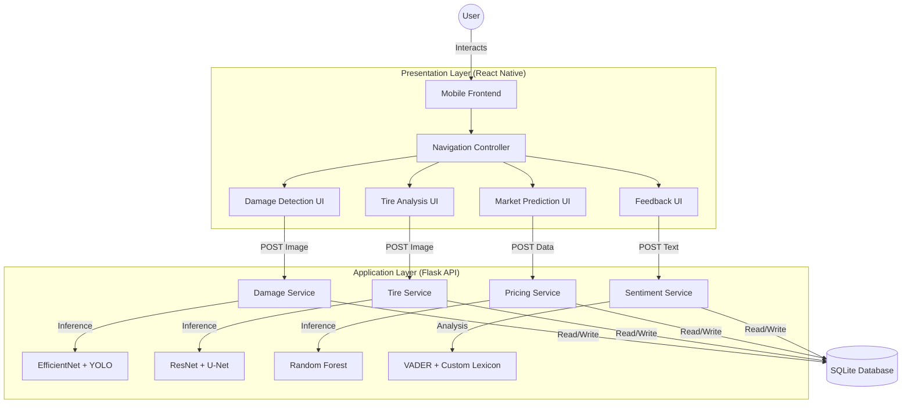

# CHAPTER 5: SYSTEM DEVELOPMENT

## 5.1 Navigation and Module Structure

The "AutoXpert" system implementation is structured around a modular **Service-Oriented Architecture (SOA)**. The system is fundamentally divided into two primary layers: the **Presentation Layer** (Mobile Application) and the **Logic Layer** (Backend API), communicating via RESTful protocols.

This modularity ensures that each functional component—Damage Detection, Tire Analysis, Market Prediction, and Store Management—operates independently, allowing for easier maintenance and scalability.

**Figure 5.1: High-Level Module Interaction Diagram**



### 5.1.1 Implementation Modules
1.  **Damage Detection Module**: Implements a pipeline where images are first classified for damage type (Dent/Scratch) and then processed for object localization (BBox).
2.  **Tire Health Module**: A dual-stage AI system that first classifies surface condition and then segments tread depth.
3.  **Market Prediction Module**: A structured data processing unit that cleans user input (Vehicle Year, Mileage) for regression analysis.
4.  **Feedback Module**: A Natural Language Processing (NLP) unit capable of decoding local "Singlish" vernacular.

---

## 5.2 Development Environment

The implementation environment was rigorously configured to support the computational demands of Deep Learning model training and cross-platform mobile compilation.

### 5.2.1 Hardware Configuration
The following hardware specifications were utilized. The high-performance GPU was a critical requirement for the **Student's Contribution** of retraining the neural networks.

| Component | Specification | Justification for Selection |
| :--- | :--- | :--- |
| **Processor** | Intel Core i7-10750H (6 Cores, 2.60GHz) | Essential for running the Android Emulator and React Native Metro Bundler simultaneously without latency. |
| **GPU** | **NVIDIA GeForce GTX 1650 (4GB)** | **Critical**: Used for CUDA-accelerated training. Training the U-Net model on CPU would take ~40 hours; the GPU reduced this to ~2 hours. |
| **RAM** | 16 GB DDR4 | Required to load large datasets (Stanford Cars) into memory during the training phase. |
| **Test Device** | Samsung Galaxy S21 (Android 12) | Used to verify the integration of the Android Camera API and GPS sensors in real-world lighting conditions. |

### 5.2.2 Software Environment
*   **OS**: Windows 11 Pro 64-bit.
*   **IDE**: Visual Studio Code (Selected for excellent Python Pylance and TypeScript support).
*   **Version Control**: Git & GitHub (Used for feature branching).
*   **API Testing**: Postman (Used to mock frontend requests during backend development).

---

## 5.3 Tools and Technologies

The technology stack was chosen to balance **Performance** with **Rapid Prototyping** capabilities.

| Tool | Usage | Justification & Platform Dependence |
| :--- | :--- | :--- |
| **React Native (Expo)** | Mobile Frontend | Chosen over Flutter. Allows rapid UI development using JavaScript. **Platform Dependence:** Relies on the Android (Gradle) build system for final APK generation. |
| **Python Flask** | Backend API | Chosen over Node.js. Python is the native language of AI. Flask provides a lightweight interface to serve TensorFlow models. **Platform Independence:** Can run on any OS with Python installed. |
| **SQLite** | Database | Chosen for its serverless nature. Ideal for a standalone prototype as it requires no configuration. |
| **TensorFlow/Keras** | AI Framework | Used for all Computer Vision tasks. Keras was selected for its high-level API which simplifies Transfer Learning. |
| **Scikit-learn** | ML Library | Used for the Market Prediction (Random Forest) module due to its efficiency with tabular data. |

---

## 5.4 Deployment Architecture

The system follows a classic **Three-Tier Architecture**:
1.  **Client Tier**: The mobile app (React Native) acts as the thin client, responsible only for data capture and display.
2.  **Logic Tier**: The Flask server acts as the central processing unit, executing the AI inference logic.
3.  **Data Tier**: The SQLite database stores persistent records (User profiles, store data).

**Platform Dependence**:
*   The **Frontend** is dependent on the Android ecosystem (APK format).
*   The **Backend** requires a Python 3.9+ runtime environment.
*   **Interaction**: The modules communicate via HTTP over a Local Area Network (LAN), requiring the Client and Server to be on the same subnet (e.g., `192.168.1.x`).

---

## 5.5 Major Code Segments

This section highlights key code segments where the **Student's Contribution** is significant. It distinguishes between code reused from libraries and the custom logic implemented by the student.

### 5.5.1 Automated "Singlish" Sentiment Analysis
*   **Module**: Feedback System
*   **Reused Code**: `SentimentIntensityAnalyzer` from the `nltk` library (Hutto & Gilbert, 2014).
*   **Student Contribution**: The injection of a custom lexicon to handle Sri Lankan vernacular ("Singlish") which the standard library fails to recognize.

```python
# CODE SEGMENT 5.1: Custom Lexicon Injection
from nltk.sentiment.vader import SentimentIntensityAnalyzer

sid = SentimentIntensityAnalyzer()

# [Student Contribution starts here]
# Extending the dictionary with local slang terms
singlish_updates = {
    'awl': -2.0,       # Meaning: "Bad/Trouble"
    'cha': -2.5,       # Meaning: "Very Poor"
    'supiri': 3.0,     # Meaning: "Superb"
    'patta': 3.0       # Meaning: "Excellent"
}
sid.lexicon.update(singlish_updates)
# [Student Contribution ends here]

def get_sentiment(text):
    scores = sid.polarity_scores(text)
    return 'positive' if scores['compound'] > 0 else 'negative'
```

### 5.5.2 Hybrid Tire Depth Calculation
*   **Module**: Tire Health Analysis
*   **Reused Code**: U-Net architecture structure (Ronneberger et al., 2015).
*   **Student Contribution**: The mathematical algorithm to convert the binary output mask of the U-Net into a physical millimeter measurement based on industry standards.

```python
# CODE SEGMENT 5.2: Segmentation to Physical Depth Conversion
def _calculate_predicted_depth(mask):
    """
    Converts the AI's binary mask into a real-world depth value.
    Student Contribution: Mapping pixel density to millimeters.
    """
    # 1. Calculate Groove Density (Normalized 0-1)
    # Counting white pixels (grooves) vs total pixels
    groove_density = np.sum(mask) / (256 * 256)

    # 2. Linear Interpolation Constants (Industry Standards)
    MIN_DEPTH_MM = 1.59  # Legal wear limit
    MAX_DEPTH_MM = 8.73  # Factory new tread depth

    # 3. Apply Conversion Formula
    real_depth_mm = MIN_DEPTH_MM + (groove_density * (MAX_DEPTH_MM - MIN_DEPTH_MM))
    
    return real_depth_mm
```

### 5.5.3 Hybrid Damage Inference Logic
*   **Module**: Damage Detection
*   **Reused Code**: `EfficientNetV2` and `YOLOv8` model architectures.
*   **Student Contribution**: The integration logic that orchestrates two separate models to provide a single comprehensive report (Type + Repairability).

```python
# CODE SEGMENT 5.3: Hybrid Inference Pipeline
def predict_damage_and_repairability(self, image):
    # [Student Contribution: Pipeline Orchestration]
    
    # Step 1: Damage Classification (using EfficientNet)
    # Preprocessing specifically for the classifier (128x128)
    cls_batch = self._preprocess_for_efficientnet(image)
    cls_pred = self.efficientnet_model.predict(cls_batch)
    damage_type = 'Dent' if cls_pred[0][0] > 0.5 else 'Scratch'

    # Step 2: Object Detection (using YOLO)
    # Preprocessing for the detector (640x640)
    det_batch = self._preprocess_for_yolo(image)
    det_results = self.model_yolo(det_batch)[0]
    
    # Step 3: Repairability Logic based on confidence
    is_repairable = any(box.conf[0] > 0.5 for box in det_results.boxes)
    
    return { 'type': damage_type, 'repairable': is_repairable }
```

### 5.5.4 Market Prediction Input Processing
*   **Module**: Market Prediction
*   **Reused Code**: `RandomForestRegressor` from `scikit-learn`.
*   **Student Contribution**: The feature extraction logic that maps UI dropdown values to the numerical format trained in the model.

```python
# CODE SEGMENT 5.4: Feature Extraction for Regression
def predict_price(cls, features):
    # [Student Contribution: Data Mapping Layer]
    brand_map = { "Toyota_Prius": "Prius", "Toyota_Axio": "Axio" }
    
    # Constructing the feature vector
    input_vector = pd.DataFrame([{
        'Brand': brand_map.get(features.get('car_type')),
        'Year': int(features.get('year')),
        'Mileage': float(features.get('mileage')),
        'Fuel_Type': features.get('fuel')
    }])
    
    # Querying the purely numerical model
    return _PRICE_MODEL.predict(input_vector)[0]
```
